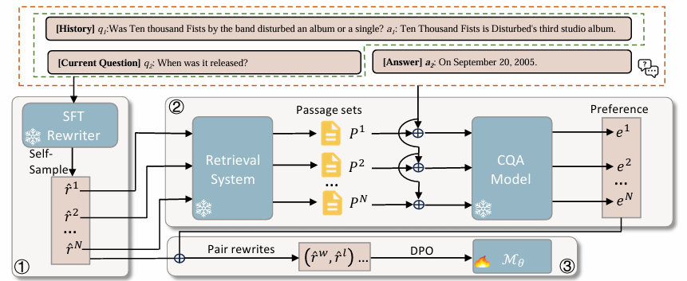

# Adaptive Query Rewriting: Aligning Rewriters through Marginal Probability of Conversational Answers (AdaQR)
Official Implementation of "[Adaptive Query Rewriting: Aligning Rewriters through Marginal Probability of Conversational Answers](https://aclanthology.org/2024.emnlp-main.746/)".



## Requirements
```
torch==2.4.0
tokenizers==0.20.0
datasets==2.21.0
```

## QReCC

All retrieval processes follow the EMNLP2023 project: [Enhancing Conversational Search: Large Language Model-Aided Informative Query Rewriting](https://github.com/smartyfh/InfoCQR)

## Training and inference
### Step 1. Build Index & Data Preproces
Please follow [Enhancing Conversational Search: Large Language Model-Aided Informative Query Rewriting](https://github.com/smartyfh/InfoCQR)'s instruction on Usage-Data Preparation. 

### Step 2. SFT & Sample Rewrites 

`cd train`

Run SFT using the data from the 1st step
```
CUDA_VISIBLE_DEVICES=0 python3 sft.py \
        --model_name_or_path {Huggingface_checkpoint_name} \ #  Llama2, Mistral and Gemma are supported
        --output_dir {sft_model_save_checkpoint_path} \
        --gradient_accumulation_steps 16 \
        --learning_rate 1e-4 \
        --per_device_train_batch_size 2 \
        --save_strategy epoch \
        --warmup_ratio 0.1 \
        --logging_steps 10 \
        --save_total_limit 1 \
        --num_train_epochs 3
```

Sample rewrites using the SFT checkpoint
```
CUDA_VISIBLE_DEVICES=0 python3 sample.py \
        --model_name_or_path {sft_model_save_checkpoint_path}/sft_checkpoint \
        --output_file {sft_result_file_name.json} \
        --dataset_name processed_data/train_data_for_sample_3.8k.json \
        --batch_size 6 \
        --num_sample 3 \
        --temp 1
```

{sft_result_file_name.json} has the below format(examples)
```
[
    {
        "Conversation_no": 1, 
        "Turn_no": 2, 
        "conversation": # concatenated history,
        "question": "Did Gary sing well?", # current question
        "rewrite": [# SFT model sampled rewrites, we set K=3 candidates per question] 
    },
    ... ...
]
```
### Step 3. Calculate Rewards for Sampled Rewrites

`cd rewards_scripts`

#### 3.1 Get top-k retrieval results per rewrite per instance


Run to get top-k retrieval passages (and scores) for each rewrite candidate sampled by SFT model
```
python3 step1_get_retrieval_candidates.sample_input.py \
    --raw_data_path {sft_result_file_name.json} \
    --data_file {sft_result_file_name.json} \
    --source_data_path ../data/qrecc/train-modified.json \
    --preprocessed_data_path {step1_result_save_file_path} \
    --pyserini_index_path {build_index_path}
```


> Output data [step1_result_save_file.json] format (examples). We use 3 sampled rewrites by SFT model
```
[
    {
     "Conversation_no": 1,
     "Turn_no": 2,
     "Question": "Did Gary sing well?",
     "Truth_answer": "Yes, Gary Cherone is also known for his work as the lead vocalist of the Boston rock group Extreme.", # answer
     "NewContext": # history list,
     "rewrite": {
      "rewrite1": {
       "rewrite": ..., # sampled rewrite1
       "docs": [
        {
         "id": ..., # doc id
         "score": ..., # doc retrieval score
         "text": ... # doc text
        },
        ...
        {
         "id": ...,
         "score": ...,,
         "text": ...,
        }
       ]
      },
      "rewrite2": {
       "rewrite": ..., # sampled rewrite2
       "docs": ...
      },
      "rewrite3": {
       "rewrite": ..., # sampled rewrite3
       "docs": ...
      }
     }
    }
]
```
#### 3.2 Compute loss per retrieved doc per rewrite per instance

For each instance, for each SFT sampled rewrite, compute the loss in generating the answer given to the question (w/ history) and each retrieved document in step1. 
```
python3 step2_qa_reward.v2_readin.py \
    --psg_max_id_num 3000 \
    --psg_type single \ # whether concate all top-k passage as a single one or process each passage one-by-one
    --gpu 4 \
    --ques_type history \
    --input_path {step1_result_save_file_path} \
    --output_path {step2_result_save_file_path}
```

> Output data [step2_result_save_file.json] format (examples).
```
"rewrite1"/"rewrite2"/"rewrite3": [
  {
   "sample": {
    "id": "1_2",
    "doc_labels": [
     [
      doc id,
      doc retrieval score
     ],
     ...
    ],
    ...
    "answer": "Yes, Gary Cherone is also known for his work as the lead vocalist of the Boston rock group Extreme."
   },
   "scores": [
    loss in generating the answer given to each doc,
    ... ...
   ]
  },
  ...
  {
    ... 
  }
]
```

#### 3.3 Compute reward per rewrite per instance

```
python3 step3_aggregate_reward.py {reward_result_file_path} {step2_result_save_file_path} {step1_result_save_file_path}
```

> Output data [reward_result_file.json] format (examples).
```
[
    {
     "Conversation_no": 1,
     "Turn_no": 2,
     "Question": "Did Gary sing well?",
     "NewContext": # history,
     "Truth_answer": # answer,
     "rewrites": {
      "rewrite1": {
       "question": # sampled rewrite1,
       "score": # reward score,
      },
      "rewrite2": {
       "question": # sampled rewrite2,
       "score": # reward score,
      },
      "rewrite3": {
       "question": # sampled rewrite3,
       "score": # reward score,
      }
     }
    },
]
```

#### 3.4 Construct rewrite pairs for DPO
```
cd train
python3 get_dpo_data_qa_loss_sample.py {reward_result_file.json} {rewrite_pairs_file_name.json}
```
### Step 4. DPO and generate rewrites
`cd train`
```
CUDA_VISIBLE_DEVICES=0 python3 dpo.py \
        --model_name_or_path {sft_model_save_checkpoint_path}/sft_checkpoint \
        --output_dir {dpo_lora_save_checkpoint_path} \
        --dataset_name {rewrite_pairs_file_name.json} \
        --gradient_accumulation_steps 32 \
        --learning_rate 1e-5 \
        --per_device_train_batch_size 1 \
        --save_strategy epoch \
        --warmup_ratio 0.1 \
        --logging_steps 10 \
        --save_total_limit 1 \
        --num_train_epochs 2

CUDA_VISIBLE_DEVICES=0 python3 generate.py \
        --model_name_or_path {sft_model_save_checkpoint_path}/sft_checkpoint \
        --adapters_name {dpo_lora_ckpt_save_checkpoint_path} \
        --output_file {final_output_file_name.json}  \
        --dataset_name processed_data/test_data.json
        --batch_size 4
```

> Output data {final_output_file_name.json} format (examples).
```
{"Conversation_no": 1, 
 "Turn_no": 2, 
  "conversation": "Q: What is a physician's assistant? A: physician assistants are medical providers who are licensed to diagnose and treat illness and disease and to prescribe medication for patients", 
  "question": "What are the educational requirements required to become one?", 
  "rewrite": "What are the educational requirements required to become a physician assistant?"}
...
```
### Step 5. Evaluation

5.1 Get top-k retrieval results per rewrite generated by trained models for test set
```
python3 retrieval_evaluation_bm25.py \
  --task qrecc \
  --split test \
  --preprocessed_data_path {test_result_save_file_path} \
  --pyserini_index_path {build_index_path} \
  --data_file {final_output_file}  \ # DPO test set samples
  --qrel_path {qrel_path} \
  --out_sfx {out_file_name}.top50 \
  --top_k 50
```

5.2 Evaluation Performance
```
cd evaluation
performance.ipynb
```


## Bibinfo
If you found this repo helpful, please help us by citing this paper:
```
@inproceedings{zhang-etal-2024-adaptive,
    title = "Adaptive Query Rewriting: Aligning Rewriters through Marginal Probability of Conversational Answers",
    author = "Zhang, Tianhua  and Li, Kun  and Luo, Hongyin  and Wu, Xixin  and Glass, James R.  and Meng, Helen M.",
    booktitle = "Proceedings of the 2024 Conference on Empirical Methods in Natural Language Processing",
    year = "2024",
}
```